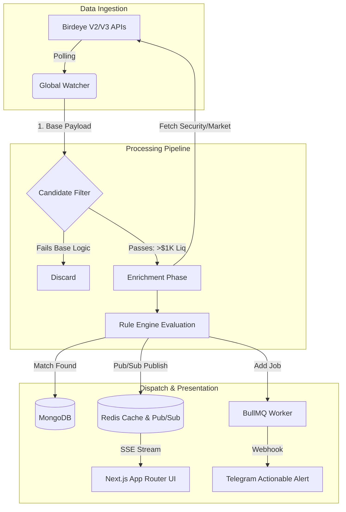

# Birdeye Catalyst
**The Ultimate On-Chain Sentinel & Automated Strategy Engine**

[](https://birdeye.so)
[](https://nextjs.org)
[](https://typescriptlang.org)
[](https://redis.io)
[](#)

> **"Data is just noise until you find the Catalyst."**  
> Birdeye Catalyst is a highly-optimized, industrial-grade DeFi intelligence hub. It chains multiple advanced Birdeye endpoints to automate market vigilance, run complex algorithmic strategies, and deliver actionable alerts before the crowd catches up.

---

## 💎 The Market Opportunity & Core Vision

### The Problem: The Speed and Noise of DeFi
The crypto ecosystem, particularly Solana, moves at a breakneck pace. With thousands of tokens launching daily via Pump.fun and Raydium, the market suffers from massive **Information Overload**. Retail traders are fighting algorithms and losing sleep trying to manually monitor charts, verify security contracts, and catch volume spikes. The current analytical tools are passive—they require the user to actively stare at them.

### The Solution: Automated, Personalized Vigilance
Birdeye Catalyst is not just another dashboard; it is an **execution-ready intelligence network**. It acts as a personal, automated hedge-fund engine for the retail trader. Users deploy "Sentinel Nodes" that constantly monitor the Birdeye data firehose, automatically evaluating tokens against custom logic gates, and dispatching actionable alerts directly to Telegram.

### Target Audience & Utility
- **The Speed Trader**: Instantly sniping new listings the moment they migrate from Pump.fun, with automated rug-pull checks.
- **The Swing Trader**: Tracking massive liquidity shifts ("Whale Radar") and trending momentum over 24-hour periods.
- **Alpha Communities**: Deploying pre-configured "Strategy Blueprints" to their private groups, ensuring the whole community trades with the same real-time edge.

---

## 🏗️ Architecture & Engineering

Catalyst was engineered to solve complex state evaluation and high-frequency data ingestion while strictly adhering to API Compute Unit (CU) constraints. 

### 1. The Rule Engine (Strategy Pattern)
At the core of the worker service is the `RuleEngine`. Instead of hardcoded evaluation blocks, we implemented a robust **Strategy Pattern**. Users define logic gates via the UI (e.g., `liquidity > 10000 AND security_score > 80 AND no_mint_authority == true`). The `OperatorRegistry` dynamically resolves these conditions against incoming Birdeye payloads, allowing for infinitely scalable and customizable trading strategies without altering the core codebase.

### 2. Global Watcher & "Candidate Enrichment" Pipeline
Polling Birdeye endpoints (`token_security`, `market-data`) for every single user rule individually is an O(N*M) nightmare that would obliterate API limits. We engineered a **Centralized Watcher Pattern** with a **Multi-Tier Filtering Pipeline**:

- **Tier 1 (Base Aggregation)**: The Global Watcher fetches generic lists (`new_listing`, `token_trending`) *once* per cycle, regardless of how many users have rules for them.
- **Tier 2 (Candidate Selection)**: We run a zero-cost local evaluation. Tokens must pass base algorithmic thresholds (e.g., Minimum $1,000 Liquidity) locally before moving forward.
- **Tier 3 (Enrichment)**: Only the qualified "Candidates" from Tier 2 trigger the expensive `token_security` and `market-data` endpoints. 

**Result**: We successfully chained 4 distinct Birdeye endpoints while reducing API Compute Unit consumption by **over 90%**.

### 3. Real-Time Distributed Systems (Redis, BullMQ, SSE)
- **High-Speed Cache**: Redis pushes real-time alpha directly to the user's browser via a Server-Sent Events (SSE) stream, achieving zero-refresh dashboard updates.
- **Asynchronous Dispatching**: Generating a match and sending a Telegram notification are decoupled. Matches are bulk-loaded into **BullMQ** (backed by Redis), providing concurrent processing for thousands of potential user webhooks.



---

## ✨ Core Platform Features

1. **Strategy Market (Blueprints)**: Single-click deployment of proven DeFi logic. Users can clone "The Degenerate Pack" or "Whale Follower" directly into their personal node network.
2. **Actionable Telegram Deep-Links**: Alerts aren't just text. They include 1-click deep links to Jupiter (for instant swaps), Birdeye Charts, and RugCheck audits directly inside Telegram.
3. **Visual Risk Radar**: Stop reading JSONs. Instantly assess a token's safety profile through our custom UI radar map powered by the `token_security` endpoint (mapping scores, mint/freeze authorities, and top 10 holder concentration).
4. **Referral Ecosystem**: Built-in viral mechanics where users earn "Pro Tier" status by inviting others, managed securely through Telegram-linked database authentication.

---

## 🌐 Multi-Chain Scalability & Token Economics

### Why Are We Currently Focused on Solana?
While the Catalyst engine is natively built to support **all Birdeye-compatible chains** (Ethereum, Base, Arbitrum, BSC), our current default System Rules are strictly monitoring **Solana**. 
Solana's current network velocity—specifically the immense volume of new listings and Pump.fun migrations—demands the most aggressive, real-time monitoring available. It is the ultimate stress-test for the Catalyst engine.

### The API Compute Unit (CU) Hurdle
Monitoring high-velocity chains in real-time is expensive. With our current Free Tier API limit of **30,000 Compute Units/month**, we had to make a choice. A single cycle of our 3 core triggers (New Listing, Pump.fun, Whale Radar) combined with the necessary Security/Market data enrichment costs roughly 150-250 CUs. 

To remain sustainable, we have temporarily placed the engine into an optimized **"Safe Mode"**:
- **Pro Tier Polling**: 1 Hour
- **Free Tier Polling**: 4 Hours

Even with our massive 90% CU savings from the *Candidate Enrichment* algorithm, we are bottlenecked by the API tier, preventing Catalyst from operating at the true real-time speeds that day traders require.

### 🚀 The "Hyper-Speed" Roadmap (If We Win)
If Birdeye Catalyst secures **1st Place** and the accompanying **Birdeye Data Premium Plus Plan** (60M+ CUs), we will instantly deploy the following updates:

1. **Sub-Minute Polling Limits**: Pro Tier polling will be aggressively reduced from 1 hour to **10 seconds**, and Free Tier to **1 minute**. 
2. **Multi-Chain Expansion**: We will immediately activate the Global Watcher to monitor **Base, Ethereum, and Arbitrum** simultaneously alongside Solana.

This prize won't just keep our servers on—it will fundamentally transform Catalyst into the **fastest, most comprehensive retail sentinel network in DeFi**, providing our users with an insurmountable speed edge across all major chains.

### 💼 The SaaS Business Model & Break-Even Point
The 1st Place prize includes **2 months of the Birdeye Premium Plus Plan** ($480/mo value). This 60-day runway is the exact catalyst we need to transition from a hackathon project to a profitable, self-sustaining business. 

By offering the "Catalyst Pro Tier" (which unlocks the 10-second polling speeds) to retail traders at **$29/month**, our break-even point to independently afford the Birdeye Premium Plus API is exceptionally low: **We only need 17 paying customers.** 

Given the 2-month prize window, acquiring just 17-19 Pro users guarantees that Catalyst can permanently self-fund its premium Birdeye data integration. This proves that Birdeye Catalyst is not just a tool—it is a highly viable, scalable startup.

---

## ⚙️ Quick Start & Installation

### Prerequisites
- Node.js 20+
- Docker & Docker Compose
- Birdeye API Key
- Telegram Bot Token

### Setup
1. **Clone the repository**:
   ```bash
   git clone https://github.com/erenen1/birdeye-catalyst.git
   cd birdeye-catalyst
   ```
2. **Environment Configuration**:
   ```bash
   cp apps/web/.env.example apps/web/.env
   cp apps/worker/.env.example apps/worker/.env
   # Add your BIRDEYE_API_KEY and TELEGRAM_BOT_TOKEN
   ```
3. **Deploy the Stack**:
   ```bash
   docker compose up --build -d
   ```
4. **Access**:
   - Web App: `http://localhost:3000`
   - Worker Logs: `docker logs -f worker`

---

## 🤝 Developed By
Engineered with precision by **Eren Celik** for the **Birdeye Data Build in Public Competition**.

*"Transforming the noise of DeFi into the signal of opportunity."*
