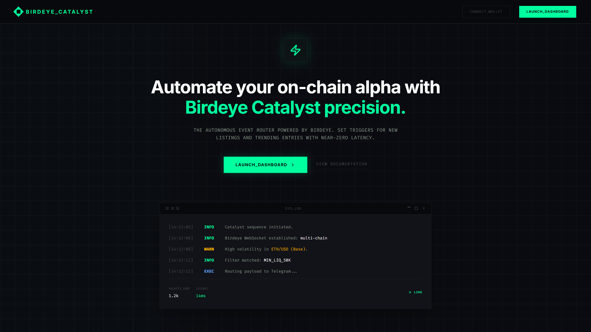
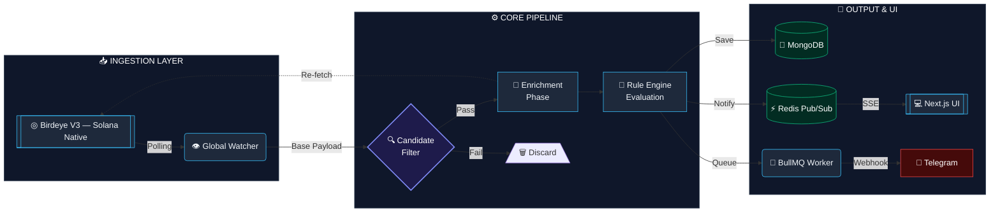

# Catalyst Terminal 🦅
**The AI-Agentic Intelligence Terminal for the Solana Frontier**

[](https://superteam.fun)
[](https://colosseum.org)

[](https://birdeye.so)
[](https://nextjs.org)
[](https://typescriptlang.org)
[](https://redis.io)
[](#)



> **"Data is just noise until you find the Catalyst."**  
> Catalyst Terminal is an industrial-grade, AI-agentic intelligence hub built for the **Solana Frontier**. By chaining high-fidelity Birdeye V3 data with custom Transformer-based AI, it automates alpha discovery, security auditing, and strategy execution—delivering institutional-grade insights to retail traders before the crowd catches up.

---

## 💎 The Market Opportunity & Core Vision

### The Problem: The Solana Noise Floor
Solana is the most active retail chain in existence. With thousands of tokens launching daily via **Pump.fun** and migrating to **Raydium**, the ecosystem suffers from massive **Information Overload**. Traders are losing to MEV bots and "rug pulls" while manually monitoring Telegram groups and Solscan. Existing tools are passive; they don't *think*, they just *display*.

### The Solution: Automated, Personalized Vigilance
Catalyst Terminal is not just another dashboard; it is an **execution-ready intelligence network**. It acts as a personal, automated hedge-fund engine for the retail trader. Users deploy "Sentinel Nodes" that constantly monitor the Birdeye data firehose, automatically evaluating tokens against custom logic gates, and dispatching actionable alerts directly to Telegram.

### Target Audience & Utility
- **The Alpha Hunter**: Sniping new listings the moment they migrate from **Pump.fun**, with automated, sub-second security checks.
- **The Whale Watcher**: Tracking massive liquidity shifts across **Solana DEXs** and identifying early smart-money accumulation.
- **DAO & Alpha Communities**: Deploying "Strategy Blueprints" to private groups, ensuring members trade with a data-driven edge.

---

## 🏗️ Architecture & Engineering

Catalyst was engineered to solve complex state evaluation and high-frequency data ingestion while strictly adhering to API Compute Unit (CU) constraints. 

### 1. The Rule Engine (Strategy Pattern)
At the core of the worker service is the `RuleEngine`. Instead of hardcoded evaluation blocks, we implemented a robust **Strategy Pattern**. Users define logic gates via the UI (e.g., `liquidity > 10000 AND security_score > 80 AND no_mint_authority == true`). The `OperatorRegistry` dynamically resolves these conditions against incoming Birdeye payloads, allowing for infinitely scalable and customizable trading strategies without altering the core codebase.

### 2. Global Watcher & "Candidate Enrichment" Pipeline
Polling Birdeye endpoints (`token_security`, `market-data`) for every single user rule individually is an O(N*M) nightmare that would obliterate API limits. We engineered a **Centralized Watcher Pattern** with a **Multi-Tier Filtering Pipeline**:

- **Tier 1 (Base Aggregation)**: The Global Watcher fetches generic lists (`new_listing`, `token_trending`) *once* per cycle, regardless of how many users have rules for them.
- **Tier 2 (Candidate Selection)**: We run a zero-cost local evaluation. Tokens must pass base algorithmic thresholds (e.g., Minimum $1,000 Liquidity) locally before moving forward.
- **Tier 3 (Enrichment)**: Only the qualified "Candidates" from Tier 2 trigger the expensive `token_security` and `market-data` endpoints. 

**Result**: We successfully chained 4 distinct Birdeye endpoints while reducing API Compute Unit consumption by **over 90%**.

### 3. Real-Time Distributed Systems (Redis, BullMQ, SSE)
- **High-Speed Cache**: Redis pushes real-time alpha directly to the user's browser via a Server-Sent Events (SSE) stream, achieving zero-refresh dashboard updates.
- **Asynchronous Dispatching**: Generating a match and sending a Telegram notification are decoupled. Matches are bulk-loaded into **BullMQ** (backed by Redis), providing concurrent processing for thousands of potential user webhooks.



---

## 🧠 The Catalyst AI Engine

At the heart of our macro-analysis engine lies a state-of-the-art Python (FastAPI/PyTorch) microservice designed for institutional-level on-chain analysis. 

### 1. Time-Series Transformer Architecture
We discarded standard LSTMs in favor of a custom **Time-Series Transformer**. Utilizing Positional Encodings and Multi-Head Attention, the model evaluates 4H batch sequences (up to 60 periods) to understand long-term price and volume relationships, predicting token momentum (BULLISH, BEARISH, NEUTRAL, HIGH_RISK) with deep contextual awareness.

### 2. Multi-Dimensional Feature Engineering
The AI does not look at raw price alone. Before inference, the engine calculates:
- **Directional Buy/Sell Pressure:** Evaluating Maker/Taker ratios to distinguish genuine accumulation from panic selling.
- **Smart Money Index:** Normalizes average trade size against the total liquidity pool to flag extreme Insider/Sniper activity.
- **Advanced Technical Indicators:** Real-time computation of RSI, MACD, and Volume-Weighted Average Price (VWAP) as direct inputs to the Transformer.

### 3. Asymmetric Risk Engine (The Guillotine)
The system employs a ruthless, rules-based multiplier on top of the AI base score:
- **Extreme Risk (0.1x Penalty):** If the Top 10 holders own >80% of the supply and the Liquidity Pool is *not* burned.
- **Ultra Safe (2.0x Bonus):** If the LP is burned, ownership is decentralized (<20%), and Freeze/Mint authorities are revoked.
- **Market Baseline (Beta):** The engine cross-references token performance against macro Solana (SOL) price changes, rewarding tokens that show resistance to market-wide dumps.

### 4. Production-Ready Infrastructure
- **Stateless Redis Caching:** Responses are cached via Redis to ensure sub-millisecond response times during high-traffic loads.
- **Batch Inference & Masking:** The endpoint accepts `BatchAnalyzeRequest` payloads, applying attention masks (padding) to process hundreds of token trajectories simultaneously via matrix multiplication.
- **Focal Loss Training:** The model is built using Focal Loss to combat the severe class imbalance in DeFi (where 95% of tokens fail), forcing the AI to focus on discovering the rare, high-alpha candidates.

---

## ✨ Core Platform Features

1. **Strategy Market (Blueprints)**: Single-click deployment of proven DeFi logic. Users can clone "The Degenerate Pack" or "Whale Follower" directly into their personal node network.
2. **Actionable Telegram Deep-Links**: Alerts aren't just text. They include 1-click deep links to Jupiter (for instant swaps), Birdeye Charts, and RugCheck audits directly inside Telegram.
3. **Visual Risk Radar**: Stop reading JSONs. Instantly assess a token's safety profile through our custom UI radar map powered by the `token_security` endpoint (mapping scores, mint/freeze authorities, and top 10 holder concentration).
4. **Referral Ecosystem**: Built-in viral mechanics where users earn "Pro Tier" status by inviting others, managed securely through Telegram-linked database authentication.

---

## ◎ Solana-Native Architecture & Scalability

### 🚀 SVM-Optimized, Enterprise-Ready
Solana is the highest-throughput retail chain in existence — and Catalyst Terminal was built *specifically* for its velocity. **Architected for immediate Enterprise WSS activation**, our security and ingestion modules are designed to handle Solana's unique high-frequency event model: Pump.fun migrations, Raydium LP creations, and SPL token lifecycle events.

We avoided the "we support all chains" trap. Instead, we went deep into Solana's DNA:
- **Solana-Specific Enrichment:** Every token is evaluated against Solana-native metrics: LP burn status, Freeze/Mint authority revocation, and top-10 SPL holder concentration.
- **AI/ML Scoring on Solana Data:** Our Transformer engine is trained exclusively on Solana on-chain patterns, not generic multi-chain noise.

## 💼 On-Chain Subscription Model (Not Forced Tokenomics)

We deliberately avoided forced tokenomics. Catalyst Terminal is a **real business with a clear path to profitability**, built on top of Solana's payment infrastructure.

### How It Works
- **Payments are native to Solana:** Pro subscriptions are paid in **USDC via Solana Pay**, keeping everything on-chain, trustless, and Solana-native.
- **No governance token. No staking.** Users pay for real utility and receive a verifiable on-chain "Pro Access" credential tied to their wallet.

### The 17-User Break-Even Point
Catalyst Terminal is a **high-margin, scalable on-chain software business**.

- **Self-Sustaining at 17 Users:** At just **29 USDC/month**, we only need **17 paying users** to cover the Birdeye Enterprise API cost permanently. Every user beyond that is pure margin.
- **Institutional Tier:** The architecture supports white-labeling for Solana DAOs and alpha groups, creating B2B revenue streams at 10x the retail price point.
- **Viral Growth Engine:** Built-in referral mechanics give users "Pro Tier" upgrades for inviting others, minimizing Customer Acquisition Cost (CAC) to near-zero.

### 🛣️ The "Frontier" Roadmap (Colosseum Vision)
Our participation in the **Colosseum Frontier Hackathon** aims to transition from a macro-analysis tool to a real-time execution powerhouse.

1.  **WSS Enterprise Firehose:** Birdeye's Enterprise WebSockets to trigger AI inference the millisecond a Raydium LP is created.
2.  **Jupiter v6 Direct Swap:** "One-Click Execution" from Telegram alerts, routing through Jupiter's best-price aggregator without leaving the chat.
3.  **Halborn-Inspired Security Shield:** Deepening `/defi/token_security` integration for a real-time Solana "Rug Score" at the SPL token level.

---

## ⚙️ Quick Start & Installation

### Prerequisites
- Node.js 20+
- Docker & Docker Compose
- Birdeye API Key
- Telegram Bot Token

### Setup
1. **Clone the repository**:
   ```bash
   git clone https://github.com/erenen1/birdeye-catalyst.git
   cd birdeye-catalyst
   ```
2. **Environment Configuration**:
   ```bash
   cp apps/web/.env.example apps/web/.env
   cp apps/worker/.env.example apps/worker/.env
   # Add your BIRDEYE_API_KEY and TELEGRAM_BOT_TOKEN
   ```
3. **Deploy the Stack**:
   ```bash
   docker compose up --build -d
   ```
4. **Access**:
   - Web App: `http://localhost:3000`
   - Worker Logs: `docker logs -f worker`

---

## 🤝 Developed By
Engineered with precision by **Eren Celik** for the **Superteam Turkey x Colosseum Frontier Hackathon 2026**.

*"Turning Solana's noise into actionable Alpha."*
